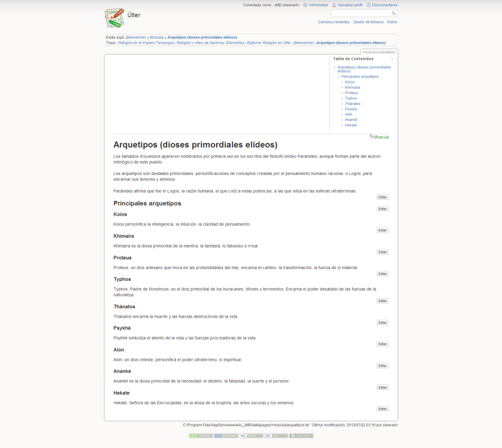

Hace ya más de un año, [en otra entrada](http://sombrasyceniza.com/2011/10/28/como-instalar-una-wiki-para-uso-personal/), hablaba de las bondades de instalar una wiki de uso personal para organizar y recopilar la información de trasfondo de una historia.

Llevo unos dos años utilizando una wiki ([Dokuwiki](https://www.dokuwiki.org/), para más señas) para archivar la información de trasfondo de mis historias, y me gustaría compartir algunos consejos con todos aquellos que se animen a emplear esta magnífica herramienta.

Si aún no lo tenéis claro, utilizar una wiki para recopilar la información de trasfondo de nuestras historias tiene, a mi modo de ver, tres ventajas principales:

### 1\. Obliga a ser coherente

Utilizar un único lugar facilita la coherencia de dicha información, dado que es más difícil que esta se «desperdigue» entre, por ejemplo, notas manuscritas, notas capturadas en alguna aplicación, informes en documentos de texto, etcétera. Naturalmente, hay que dedicar tiempo al principio y hacer un esfuerzo para «echar a andar» nuestra wiki, pero al cabo recompensa, con creces, todo el tiempo y esfuerzo invertidos.

### 2\. Evita los excesos de información en nuestros textos

De esto ya hablé [en la anterior entrada sobre cómo instalar una wiki](http://sombrasyceniza.com/2011/10/28/como-instalar-una-wiki-para-uso-personal/ "Cómo instalar una wiki para uso personal"), donde expuse una teoría de la que estoy firmemente convencido: buena parte de los excesos de información (a. k. a. [infodumps](http://tvtropes.org/pmwiki/pmwiki.php/Main/Infodump), para los que gusten de la terminología anglosajona) en las historias de género fantástico se deben a inspiraciones felices de los autores durante la escritura, que luego no quisieron podar en la —obligada y ardua, por cierto— reescritura.

[_Kill your darlings_](http://www.goodreads.com/quotes/79715-in-writing-you-must-kill-all-your-darlings) [(Mata a tus favoritos)](http://www.goodreads.com/quotes/79715-in-writing-you-must-kill-all-your-darlings), reza el adagio atribuido a William Faulkner, lo cual viene al pelo respecto a los excesos de información en una novela. Pero recortar información de trasfondo de una historia no significa prescindir de ella por completo. Si, por ejemplo, nos hemos explayado durante cinco párrafos hablando de cómo tal raza de elfos de los bosques gustan en tallar la madera, y luego nos damos cuenta de que, realmente, no viene mucho a cuento y le damos hachazo, ¿qué podemos hacer con nuestro coñazo, eh, perdón, exposición? Archivarla como un artículo de nuestra wiki. Quién sabe. Quizá más adelante nos sea muy útil.

El otro motivo principal, tanto en las historias de género fantástico como en las demás, es introducir en el texto el resultado de una profunda documentación. Aquí una wiki nos es muy útil: solo necesitaremos unos pocos datos para nuestra historia, pero el resto de la documentación, incluidas referencias y fuentes, deberíamos tenerla a mano.

### 3\. Fomenta la creatividad

Siembra enlaces… y recoge tempestades. De ideas, en este caso. Una de las características que definen la Web es la hipertextualidad. Nuestra wiki tiene una estructura basada en ese mismo principio: las páginas se hacen referencia unas a otras, de una forma que recuerda al crecimiento de una figura fractal.

Esto, que mal llevado puede ser un caos, nos permite interrelacionar los aspectos del mundo de nuestras historias de una forma mucho más completa. Digamos que nos permite ver mejor el bosque.

Una buena forma de propiciar esto es emplear enlaces huérfanos, esto es, sin páginas (aún). Si en un párrafo hacemos referencia, por ejemplo, a una batalla de la cual solo tenemos una vaga noción, incluir el enlace nos facilitará, más adelante

Bien. Vamos ahora con los consejos:

1\. Ten claro desde el principio qué uso vas a darle a tu wiki

Este punto es muy importante. Si tu idea de cómo usar tu propia wiki es vaga, acabarás por dejarla apartada a los pocos días, una vez se haya pasado la novedad.

En mi caso, no uso la wiki para almacenar borradores de informes y artículos, sino que almacenó allí los que están razonablemente terminados.

Suelo hacerlo así:

- En primer lugar, tomo apuntes sobre el tema en cuestión. Suelo usar blocs de notas, aunque últimamente empleo cada vez más Evernote.
- Una vez tengo las ideas claras al respecto del tema, compilo las notas recabadas en un artículo sencillo, del cual dejo constancia en una página de la wiki.
- A partir de ese punto, consigno todos los cambios, añadidos y desarrollos del tema en dicha página.

2\. Sé consistente

Procura seguir una estructura razonada cuando elabores las páginas de tu wiki. Una estructura razonada, con epígrafes, te ayudará a recopilar y elaborar la información que quieres incluir sobre cada tema.

Las páginas de temas similares deberían tener estructuras semejantes. Por ejemplo, las semblanzas biográficas deberían seguir una estructura similar, ordenada en epígrafes para facilitar la presentación de la información.

Para facilitar esto puedes crear plantillas de páginas para reutilizarlas. A modo de ejemplo, esta podría ser la plantilla para recopilar las notas sobre un personaje:

**Nombre (otros nombres o apodos)**

**1\. Descripción:**

Aspecto físico, personalidad, idiolecto, rasgos característicos, etcétera.

**2\. Historia:**

Principales eventos de su biografía, desde su nacimiento hasta el momento actual o su muerte.

**3\. Otros:**

Relaciones con otros personajes, familia, habilidades especiales, etcétera.

### 3\. Sé precavido

Haz copias de seguridad de tu wiki de forma periódica. Sería muy frustrante que perdieras la información que has ido vertiendo en las páginas de tu wiki por un descuido o un fallo en tu disco duro. La forma más cómoda de hacerlo es emplear algún servicio de respaldo en la nube, como Dropbox, Google Drive o SkyDrive.

### 4\. Tenla siempre a mano

Coloca un marcador o acceso directo en tu navegador, para que la tengas siempre presente. Parece un consejo algo simplón, e incluso tonto, pero al menos en mi caso ha conseguido que emplee mi wiki (tanto para consultarla como para añadir páginas) con mucha más frecuencia.

### 5\. Conoce tu wiki

Si te familiarizas con la sintaxis empleada por tu wiki evitarás frustrarte a la hora de crear páginas. Conocer lo básico de dicha sintaxis puede parecer arduo al principio, pero en cuanto le dediques un poco de tiempo verás que no es para tanto. Para facilitar el proceso ten a mano una _cheatsheet_ (una chuleta) de los principales códigos.

Para las wikis de Mediawiki (en español): [http://es.wikipedia.org/wiki/Ayuda:Referencia\_r%C3%A1pida](http://es.wikipedia.org/wiki/Ayuda:Referencia_r%C3%A1pida)

Para Dokuwiki (en inglés): [http://wiki.lnt.ei.tum.de/lib/exe/fetch.php?media=dokuwiki\_cheatsheet.pdf](http://wiki.lnt.ei.tum.de/lib/exe/fetch.php?media=dokuwiki_cheatsheet.pdf)

### 6\. Une y vencerás

Una atomización excesiva acaba llenando la wiki de páginas cortas, en plan diccionario, que no son nada recomendables porque dispersan demasiado la información. Para evitarlo recomiendo emplear página «temática», dividida en epígrafes, y el uso de enlaces de tipo «ancla», que tienen una sintaxis muy cómoda: /pagina\_de\_nuestra\_wiki#Nombre\_del\_epígrafe\_o\_sección.

Supongamos que queremos describir la religión de una determinada cultura cuyo panteón tiene X dioses principales. Podríamos emplear una página para cada uno de los dioses, pero apenas si tenemos un nombre y una descripción sucinta para cada uno de ellos. Por ahora, una única página a modo de sumario es más que suficiente y evitará dispersar la información; llegado el caso, nada impide crear una página para cada dios cuando desarrollemos la información sobre cada uno de ellos.

En esta captura de mi propia wiki tenéis un ejemplo de lo que propongo. No hay páginas aún para cada arquetipo, aunque es muy probable que las haya en el futuro:

### 7\. Inspírate

Si quieres ver ejemplos de cómo usar (y muy bien) una wiki para el trasfondo de una historia que te sirvan de inspiración para las páginas de tu propia wiki, te recomiendo estos enlaces:

- [awoiaf.westeros.org](http://awoiaf.westeros.org/): La wiki de Westerors.org (en inglés) dispone de 5102 artículos sobre el apasionante mundo creado por George R. R. Martin. Si prefieres una wiki sobre este mundo en español, tienes [hieloyfuego.wikia.com/wiki](http://hieloyfuego.wikia.com/wiki/)
- [lotr.wikia.com/wiki](http://lotr.wikia.com/wiki/): La wiki dedicada a la obra cumbre de J. R. R. Tolkien, _El Señor de los Anillos_ (en inglés) tiene casi 4700 páginas repletas de información sobre la Tierra Media.
- [es.harrypotter.wikia.com](http://es.harrypotter.wikia.com/): Otro buen ejemplo de wiki, con 2500 páginas sobre la saga de fantasía juvenil de Harry Potter. (En español.)
- [princeofnothing.wikia.com/wiki/Prince\_of\_Nothing\_Wiki](http://princeofnothing.wikia.com/wiki/Prince_of_Nothing_Wiki): Esta wiki está dedicada a la (por desgracia) no tan conocida serie de R. Scott Bakker _Príncipe de la nada,_ con «tan solo» 753 páginas con información del mundo de Eärwa. (En inglés.)

© de la imagen destacada: [http://www.flickr.com/photos/disowned](http://www.flickr.com/photos/disowned/).
