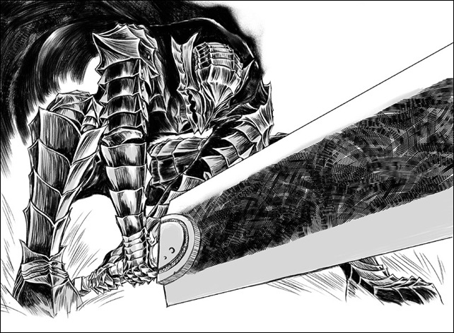
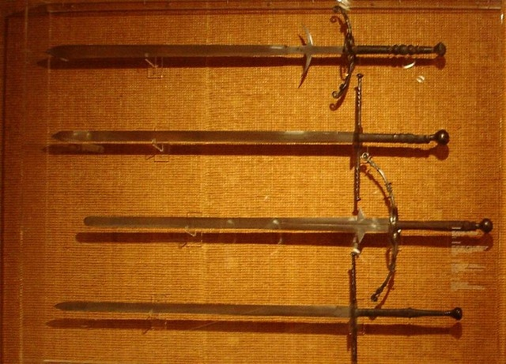
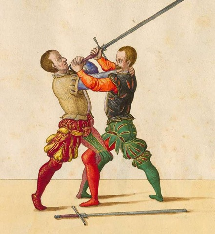
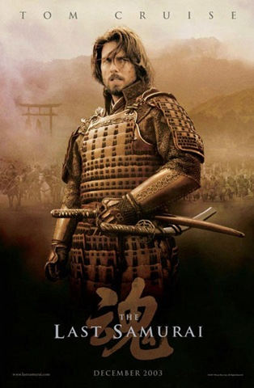
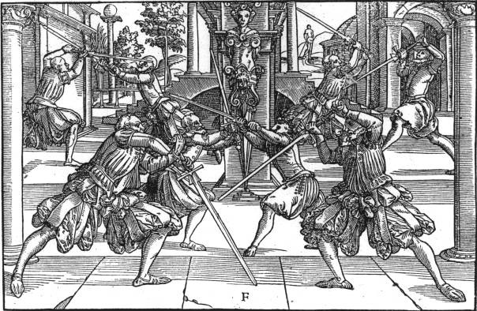

_(Viene de la [primera parte](/de-espadas-y-falacias-mitos/) de este artículo.)_

### Mito n.º 6: Las espadas a dos manos

Antes de seguir conviene hacer una aclaración breve sobre a qué me refiero con el término _espada a dos manos_. En el imaginario popular, estas espadas son enormes, pesadas e imponentes, y las manejan guerreros no menos enormes e imponentes para dar brutales tajos y reveses (entre gruñidos, para conferir aún más fiereza a la imagen).

No era para tanto. O, al menos, no siempre. Con el término _espada a dos manos_ nos podríamos referir a las llamadas _espadas bastardas_ o _de mano y media_; a las _espadas de guerra_, ya propiamente de dos manos; o a los mucho más posteriores montantes, que sí podían llegar a ser enormes, pero sin llegar a las exageraciones que en muchos casos retratan las obras de corte fantástico.

Veamos, a modo de apunte somero, qué características tenían estas espadas:

Las _espadas bastardas_ o _de mano y media_ eran armas cuya empuñadura permitía asirla tanto con ambas manos superpuestas (de ahí lo de _mano y media_) o con una sola mano. Por otro lado, las espadas de guerra —_longsword_, ((Con frecuencia, este término se ha traducido mocosuena como _espada larga_, sobre todo en manuales de rol, como en la archiconocida segunda edición del AD&D)) en inglés, o _langeschwert_, en alemán— ya tienen una empuñadura que permite, de forma cómoda, el uso de las dos manos. Su hoja es más larga, en consecuencia. ((Esta división, que en la teoría parece clara, no lo es tanto en la práctica; pero abundar en esta cuestión con propiedad requeriría un artículo aparte.))

Sobre el uso de ambas espadas, variaba mucho según la época y la morfología del arma, pero todas o prácticamente todas se usaban tanto para acuchillar con el filo como para estocar con la punta, aunque, como es lógico, había espadas diseñadas para ser usadas más de punta y otras más de filo: todo dependía del uso para el que estaban concebidas y a qué panoplia defensiva habían de enfrentarse. Para ilustrar su manejo, os dejo aquí este vídeo de la escuela de esgrima histórica alemana [The Real Gladiatores](http://gladiatores.de/), de estupenda realización: ((Si os fijáis, las espadas empleadas en este vídeo son muy flexibles y se doblan (flexan) al chocar contra el cuerpo del oponente; esto es así por la naturaleza de las espadas de práctica, diseñadas para minimizar el impacto en las estocadas durante los asaltos. Las contrapartidas históricas eran mucho más rígidas en comparación.))

https://www.youtube.com/watch?v=ohmLaZHStmI

La tendencia fue hacia el uso de la punta para enfrentarse a los arneses, lo que ya hemos visto en el mito n.º 3; de hecho, acabó por producir un tipo de espada muy específico, el estoque, con hoja de perfil de hoja romboidal o hexagonal, dotado de una punta recia pensada para colarse entre los huecos de estas armaduras.

Por último, los montantes ((No menciono términos como mandoble, bastante ambiguo ya que puede referirse a cualquier espada manejada a dos manos, o el de espadón, aún más ambiguo si cabe, al denominar cualquier espada grande, concepto bastante subjetivo.)) eran espadas de dos manos cuyo mejores exponentes aparecieron en el s. XVI. Dotadas de grandes arriaces y amplias empuñaduras, estas espadas podían tener  hojas de longitudes entre 120 y 150 cm; muchas de ellas disponían además de una segunda cruz en su tercio fuerte, o falsaguarda; el objeto de este aditamento era proporcionar defensa a la mano para cuando esta asía la espada por la hoja en determinadas acciones.

<figure>

<figcaption>

_Zweihänders_; la primera y tercera, comenzando por arriba, tienen falsaguarda.

</figcaption>

</figure>

Estas espadas se usaban principalmente para acuchillar, en movimientos amplios, muy dinámicos y poderosos debido a la inercia que acumulaban. He visto demostraciones de su uso en las que un solo esgrimista pudo rechazar a varios atacantes mediante tales molinetes: y es que acercarse a alguien que sabía manejar este arma debía de amedrentar bastante. De entre los diferentes tipos de montantes sobresalen los conocidos  _Zweihänder_ (dos manos) alemanes, usados por los _Doppelsöldner_ alemanes, llamados así por cobrar doble soldada… y por tener los huevos cuadrados, hablando mal y pronto: su cometido en combate era acometer las formaciones de piqueros a tajo limpio para abrir hueco en ellas.

En este vídeo (lamentablemente, no de muy buena calidad) podemos ver al Maestro de Armas de la AEEA [Alberto Bomprezzi](http://www.esgrimaantigua.com/AEEAAlbertoB.php) durante una demostración del manejo del montante:

http://www.youtube.com/watch?v=aRKQ2dV3pKI

En cualquier caso, no eran armas muy prácticas para su uso, por así decirlo, cotidiano. De ahí que no tenga mucho sentido mostrar a personajes llevándolas así, como si tal cosa, en medio de una ciudad, como estoy cansado de leer en muchas novelas fantásticas (cómo no, invariablemente las llevan a la espalda).

Aclarado (espero) el concepto de _espada a dos manos_, ataquemos pues el mito: estas espadas no eran ni tan abundantes ni tan prácticas como se presupone. En el cine y la TV se nota una tendencia a favorecer tales espadas, probablemente porque los productores las vean como más estéticas, aunque tengo el pálpito de que se hace para remedar la figura del samurai japonés, que tanta fascinación ha despertado en la cultura occidental.

En muchos casos, la presencia de estas espadas, además de anacrónico en numerosas ocasiones (muchas de esas producciones están ambientadas en épocas medievales, y las espadas de dos manos son, por lo general, más tardías), roza el absurdo.

¿Por qué? Muy simple. En una batalla, blandir una espada a dos manos te fuerza a renunciar al uso del escudo, el cual, por descontado, es una de las armas defensivas más extendidas en la historia bélica: por algo será. La efectividad del escudo —un arma aún en activo, por cierto, y si no observad una carga policial— está fuera de toda duda.

Así que el usuario de una espada a dos manos, sin poder hacer uso de un escudo, está vendido en una batalla en la que llueven flechas, virotes y demás cosas que matan sin mucho aviso. ¿Qué sentido tenía, entonces, llevar una espada de dos manos a una batalla?

Estar forrado de acero de pies a cabeza. Entonces sí que tiene sentido prescindir de un escudo para esgrimir una arma a dos manos: desde armas enastadas como hachas, mazas, manguales y picos de guerra pasando, claro está, por las espadas a dos manos. Pero si no nos podemos permitir una armadura que nos permita prescindir de él, nuestro mejor aliado en una batalla era el escudo.

### Mito n.º 7: Trabar las armas y mirarse con cara de cagar duro

Otro clásico que no muere. En los duelos a espada  entre el protagonista y el antagonista de turno hay un momento inevitable en el que ambos traban sus espadas durante unos segundos, que aprovechan para forcejear con cara de mucho esfuerzo y, en ocasiones, intercambiar algunas palabras, del tipo «¿Qué tal tu madre?» y otras lindezas.

En esgrima, a las acciones de combate en corta distancia se las conoce como de «juego corto». Algunas de ellas son bastante instintivas y muy eficaces: van desde trabar el arma del rival con tu propio cuerpo, hacer presas, golpear el rostro de tu oponente con los gavilanes o el pomo de tu espada, junto a muchas otras acciones con la mano izquierda.

<figure>

<figcaption>

Lámina del manual de esgrima alemán del s.XVI de Paulus Hector Mair, que muestra una acción de combate cerrado o juego corto.

</figcaption>

</figure>

Todas ellas tienen algo en común: son fulgurantemente rápidas. Lo de «forcejear» es una estupidez soberana. De hecho, lo mejor que nos puede pasar es que nuestro oponente ponga un exceso de fuerza en el juego de su hoja: es algo que puede, muy fácilmente, usarse en su contra.

Por último os remito a este vídeo, realizado por Carlos Negredo, de la [Sala de Armas El Batallador](http://www.esgrimazaragoza.com/); los primeros 30 segundos son acciones de cuerpo a cuerpo que ilustran la rapidez con la que podían llegar a resolverse estas situaciones:

http://www.youtube.com/watch?v=5YQP6lthpLA

### Mito n.º 8: Las conversaciones durante el duelo

Directamente relacionado con el anterior mito, hablar durante un duelo, intercambiando ingeniosas pullas parece, según las películas, algo habitual. Si tuviera que elegir una película para ilustrar este mito me quedaría sin dudarlo con la adaptación de la novela _La princesa prometida_, de William Goldman. Y sí, admito que estamos hablando de una película con una clara intención satírica que admite este mito.

Ahora bien, no lo veo tan disculpable en muchas películas épicas supuestamente muy serias y dramáticas. Dejémoslo claro: durante un combate o pones toda tu concentración en él o este acabará pronto y muy mal (para ti); no hay tiempo para conversar, salvo quizá para alguna imprecación entre jadeos. Y no, no es buen momento para que el malo exponga su plan maestro. Antes o después, tal vez. Durante, no es tan buena idea.

### Mito n.º 9: Las espadas de hoja irrompible

<figure>

<figcaption>

Cartel de la pelicula _The Last Samurai_; japofilia en su máxima expresión.

</figcaption>

</figure>

No es raro ver en películas una espada cortando en trozos casi cualquier cosa. Chocando con paredes. Atravesando armaduras como si nada. Incluso cortando otras espadas.

Una espada es algo mucho más frágil de lo que podríamos pensar, si se usa mal. ((Sí, incluso las _katanas_, armas que merecerían un artículo extra sobre su mito.)) Si añadimos esto al hecho de que las espadas eran muy caras, imaginad el apego que tendría un guerrero a su espada: nada de golpearla gratuitamente contra las paredes, o arrastrarlas por el suelo para hacer molones regueros de chispas.

Lo que sí cortaban y pinchaban muy bien las espadas era la ropa, piel, carne y huesos de un oponente sin armadura. Aterradoramente bien, por otra parte. ((Naturalmente, no todas las espadas mostraban las mismas aptitudes para el corte y la estocada; todo dependía del diseño del arma y sus características.)) En el caso de un oponente con armadura, la cosa ya variaba, según material y calidad de la misma: pero ya hemos dejado claro en el mito n.º 3 que las armaduras metálicas eran muy resistentes a los cortes, y que un arnés blanco era casi inexpugnable a las cuchilladas.

Pero tened clara una cosa: aunque no eran irrompibles ni invencibles, las hojas de las espadas mataban, y muy bien. Por mucho mito y fascinación que despertara, y por mucho simbolismo que tuviera asociado, un arma ineficaz no se hubiera empleado tan profusamente a lo largo de la Historia.

En la siguiente página de [Albion Armorers](http://www.albion-swords.com/cutting-knight.htm) podéis descargaros varios vídeos en formato .wmv en los que se prueba la eficacia de corte de uno de sus réplicas, una espada de una mano bautizada como _The Knight_. Echadles un ojo. No tienen desperdicio.

### Mito n.º 10: Mecánicas de combate absurdas

Comprender, ligeramente, cómo se desarrolla un combate no es tan difícil, pero hay que sacudirse muchos conceptos previos. Juegos de rol, videojuegos, novelas, películas… todo esto ha colaborado a crear una imagen muy distorsionada y absurda de cómo se desarrolla un combate con armas.

En primer lugar, la mayoría de gente piensa en que un combate se desarrolla a turnos alternos: yo tiro un tajo o una estocada, mi adversario reacciona y me ataca; vuelta a empezar. Esto no es así. En primer lugar, nadie tira una cuchillada o estocada a lo loco. Al menos, nadie que quiera vivir mucho tiempo.

<figure>

<figcaption>

Lámina del manual alemán de esgrima del s. XVI de Joachim Meyer.

</figcaption>

</figure>

Fuera de distancia, los oponentes no hacen mucho más que observar al adversario. Una vez que los adversarios llegan a estar metidos en harina, esto es, a una distancia en la que es posible disponer un ataque efectivo, ((La Verdadera Destreza española denomina esta distancia como «medio de proporción».)) las cuchilladas y estocadas se tiran en función del contrario, incluso cuando nuestra acción va primero. La esgrima de duelo es, usando una analogía científica, un [sistema abierto](http://es.wikipedia.org/wiki/Sistema_abierto), en contraposición al sistema cerrado que muchos tienen en su magín. No lanzamos tajos a locas, con la esperanza de herir al otro, sino que esperamos una oportunidad, o bien la creamos. Pero siempre basados en la información que tenemos del oponente. Así que la concepción de dos guerreros intercambiando golpes a diestro y siniestro, por turnos, es irreal… y muy tediosa, por otro lado.

Otra concepción errónea es cómo se conciben las cuchilladas. Casi siempre vemos, en el cine o descritas en la literatura, cómo el héroe o protagonista lanza cuchilladas amplias, fortísimas, con las que alcanza a su adversario de pleno y, claro, lo escabecha, atravesando armaduras y lo que haga falta (os remito a los mitos n.º 3 y 9, para más señas).

Erróneo. Las cuchilladas y estocadas rara vez son limpias, amplias y «bonitas». Estos golpes se ven venir desde muy lejos y rara vez alcanzan su objetivo, salvo que sea un monigote de paja, esté muerto o desee vivamente estarlo.

En vez de eso, las cuchilladas son cortas, rápidas, y suelen ser respuesta a una acción anterior. Se podría decir lo mismo de las estocadas. ¿Por qué? En primer lugar, el adversario no se está quieto. Su arma, o armas, están delante de nosotros, y salvo que ataquemos a un hombre desarmado, interponerlas es cosa más fácil de lo que podríamos sospechar. Solo con un movimiento instintivo y un paso atrás se pueden frustrar el 90 % de esos tajos a lo Conan con los que muchos primerizos intentan entrar en distancia durante sus primeros asaltos de práctica, imagino con la intención de decapitar a su rival (cosa que, en realidad, era bastante difícil de hacer; al menos de la forma limpia que muestran películas, series y cómics).

En segundo lugar, esas acciones amplias, cargadas de fuerza, nos dejan vendidos. Alguien mínimamente versado en esgrima no atacaría sin control y sin información del contrario.

¿A qué me refiero con información? Los oponentes, durante el combate, transmiten información continuamente. Interpretarla correctamente y aprovecharla de forma ventajosa es otro cantar, por supuesto. Entre otras consideraciones, la distancia a la que está nuestro adversario, las posiciones de sus armas, cómo se mueve, determinan los cursos lógicos a seguir.

Pero durante la lucha se tendía a cerrar la distancia hasta que las espadas se encontraban (se agregaban). De hecho, la mayoría de tratados comienzan en este momento del combate, dejando los preámbulos fuera de su materia. Una vez en esta distancia la cosa es diferente; la percepción del peligro aumenta. Tenemos al adversario encima. Si hacemos algo mal, nos herirá, y es muy probable que la herida nos incapacite, o mate. Eso cambia, desde luego, la perspectiva del asunto.

Durante esta agregación es cuando se abre una «ventana de comunicación» con tu oponente, conocido por muchos maestros como _sentimiento del hierro_ (_Liechetenauer_, maestro alemán del s. XV, la llamó _Sprechfenster_, _ventana que habla_). El _sentimiento del hierro_, algo que parece muy de mística de baratillo, es algo sencillo en apariencia pero complejo de interpretar en la práctica. A través del contacto entre las hojas de las espadas, de la agregación, los oponentes reciben y ofrecen información, respectivamente, sobre sus intenciones: cuánta presión ejerce en tu hoja y dónde son dos de los aspectos básicos del _sentimiento del hierro_.

Así, un duelo con espadas se desarrollaría, _grosso modo_, de la siguiente forma: en primer lugar, los oponentes se acercarían a la distancia adecuada para ejecutar sus acciones. Sin prisas. Calculando cada paso. Aquilatando al oponente. Ya en distancia tenderían a agregar sus hojas, y solo perderían esa agregación para ejecutar acciones, siempre basadas en la información que disponen de su adversario, tanto si toman la iniciativa como si reaccionan ante las acciones de su oponente.

Por último: es necesario aclarar que una batalla campal era una situación muy distinta,  y no cabían técnicas tan depuradas y meditadas como en los duelos (al menos en sus primeras fases; cuando la cosa se calentaba, es lógico pensar que las acciones serían más precipitadas). En lo más hondo de una liza caben acciones más instintivas y arriesgadas, dada la naturaleza caótica y demencial de una batalla multitudinaria. De ahí que un buen escudo y una buena armadura fueran tan importantes para mantenernos con vida.

### A modo de conclusión:

Y hasta aquí ha llegado el artículo. Si ha servido para despertar el interés del lector por la esgrima antigua, os animo a descubrirla en persona, bien a través de su práctica o —de una forma menos apasionante pero muy amena— a través de los eventos en los que las distintas [salas de la AEEA](http://www.esgrimaantigua.com/Salas.php) realizan demostraciones.

Y para más información sobre estos y otros mitos, recomiendo al lector que lea estos artículos:

[http://www.esgrimaantigua.com/ArticulosMitos.php](http://www.esgrimaantigua.com/ArticulosMitos.php)

[http://laespadaes.blogspot.com/2010/08/la-desconocida-espada-2-parte.html](http://laespadaes.blogspot.com/2010/08/la-desconocida-espada-2-parte.html)
