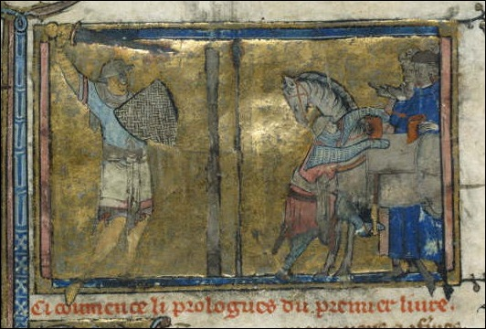
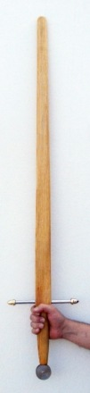
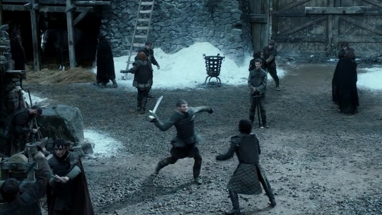
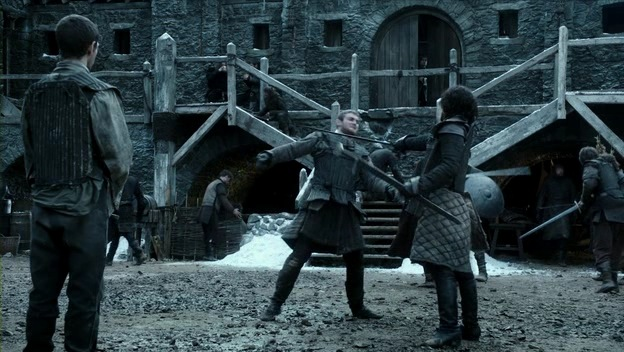
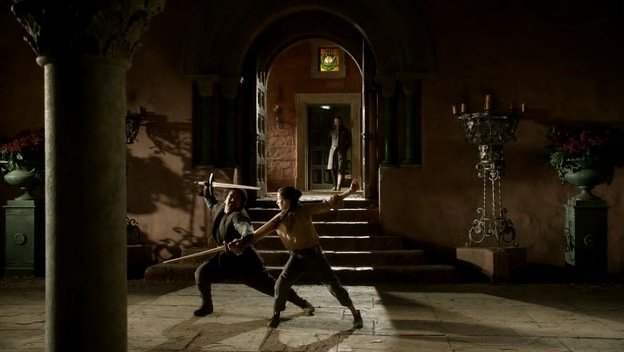

### Capítulo 3: Lord Snow

#### Escena n.º 1: Entrenamiento de la Guardia de la Noche

En este capítulo hay dos escenas en las que asistimos al entrenamiento de la Guardia de la Noche. Dejaré los comentarios sobre el combate en sí para la segunda, y en esta me centraré en las condiciones del entrenamiento en sí. Pero para poner las cosas en su contexto conviene hacer unos breves apuntes sobre cómo se adiestraban los guerreros en la Edad Media.

No se dispone de mucha información al respecto. Las fuentes históricas coinciden en que el caballero medieval comenzaba su adiestramiento muy joven, a partir de los siete años. Además de ejercicios para robustecer su cuerpo, el aprendizaje marcial comprendía el uso de la lanza, la espada y el escudo. En cuanto a estos dos últimos, uno de los ejercicios más importantes era el llamado "tirar al poste", en el juego de la espada y otras armas ((El equivalente para el uso de la lanza sería el juego del estafermo.)).

Conocido ya por los romanos, el poste (_pell_, en inglés) era uno de los útiles de entrenamiento más viejos y fiables. Era probablemente el primer ejercicio empleado para adiestrar a un combatiente. Su objetivo era desarrollar fuerza y precisión en los golpes.

\[caption id="attachment\_3889" align="aligncenter" width="532"\] Ilustración en un códice del s. XIV que muestra el ejercicio de «tirar al poste»\[/caption\]

\[caption id="attachment\_3890" align="alignleft" width="101"\] Espada de madera del artesano José Acedo\[/caption\]

Las armas cuerpo a cuerpo no se limitaban solo a la espada; la maza y el hacha eran armas usuales, incluso más efectivas según qué circunstancias; y en cualquier caso, aprender a manejar bien el escudo era primordial. En cuanto a las espadas de práctica, durante el entrenamiento era frecuente el uso de espadas de madera, o _wasters_, lastradas para que fueran más pesadas que las de acero. Las armas negras ((Armas negras son aquellas sin filo ni punta vivos, en contraposición a las armas blancas.)) no fueron usuales, por su elevado coste, hasta finales de la edad media. En cualquier caso, si bien no se dispone de mucha información sobre los combates de práctica, podemos asumir que se harían entre combatientes ya hechos al uso de la espada mediante el entrenamiento con el poste.

Dicho esto, y volviendo a la escena en sí, hay varios detalles que no me cuadraron al verla por primera vez. En primer lugar, el equipo que usa Jon y sus compañeros durante el entrenamiento con armas. Como se puede ver claramente en la escena, como protección usan una especie de petos, algo toscos, y debajo de ellos el clásico gambesón ((El gambesón era una prenda acolchada que se llevaba bajo la armadura para mitigar tanto el roce de la misma como para acolchar los golpes recibidos)). No usan ningún tipo de protección para la cabeza, sin embargo. Aunque las espadas que usan son negras, un golpe bien colocado en la cabeza podía ser muy peligroso. Los golpes tirados al cuerpo no harían demasiado daño, teniendo en cuenta la protección combinada del peto y el gambesón (y esto lo puedo atestiguar de primera mano), salvo en el caso de las manos, más expuestas de lo que parece en el juego de la esgrima, sobre todo entre combatientes inexpertos (de nuevo, puedo dar fe de esto).

Veamos cómo se describe la escena en el texto original de la novela:

> Bajo la lana negra, el cuero tratado ((_Boiled leather_ hace referencia al cuero hervido, también conocido antaño como cuir bouilli; no es más que una pieza de cuero hervida en agua o aceite, tras lo cual adquiría una gran dureza y, lógicamente, rigidez.)) y la cota de mallas, el sudor corría helado por el pecho de Jon, que forzó más el ataque. Grenn se tambaleó hacia atrás, tratando de defenderse con torpeza. Cuando alzó la espada, Jon aprovechó el hueco para lanzar un ataque con un movimiento de barrido que dio a su contrincante en la pierna y lo dejó cojeando. Al golpe descendente de Grenn respondió con otro ataque por encima del hombro que le abolló el casco. Cuando Grenn intentó un ataque lateral, Jon lo desvió y le golpeó en el pecho con el antebrazo envuelto en mallas. A continuación le asestó un mandoble en la muñeca que le arrancó un grito de dolor y le hizo soltar la espada.

Esto tiene mucho más sentido que lo representado en la serie. Tal y como puede leerse, el entrenamiento se hacía completamente pertrechado con armadura, yelmo incluido. Esto tiene una ventaja doble: acostumbrar al alumno al peso y el calor de la armadura, para incrementar su resistencia física, y protegerlo de los golpes recibidos durante el asalto con armas negras.

Eso no significa que fuera un juego de niños, ojo. No serían raros dedos rotos, mandíbulas, pómulos o narices fracturadas, y por supuesto todo un rosario de magulladuras y contusiones. El riesgo más grave sería una estocada a la zona de los ojos; y en cuanto a esto, o asumían el riesgo, o evitaban dirigir  estocadas a la cabeza.

¿Dónde está el fallo, además de las diferencias entre el texto y la interpretación de la serie, como la licencia "artística" de que no llevaran yelmo? A mi juicio, y es algo achacable tanto a la adaptación como al original, el fallo más grave es la omisión del escudo, pieza clave en el adiestramiento del guerrero medieval.

Ya comenté en el mito n.º 6 del artículo [De espadas y falacias (ii)](/de-espadas-y-falacias-ii-mitos/ "De espadas y falacias (ii)") que en el cine de Hollywood hay una especie de alergia a los escudos que encuentro especialmente irritante. Dejémoslo claro: la espada medieval, entendida como el arma por antonomasia del caballero, no tenía sentido sin la compañía del escudo.

### Escena n.º 2: Conversación entre ser Jorah y Rakharo

El comentario de ser Jorah sobre su espada, a la que llama _broadsword_ ((El término más adecuado sería _arming sword_, espada de arzón, en castellano, por el hecho que se llevaba en la silla de montar)), no va mal desencaminado del todo, aunque su afirmación de que dicha arma está "diseñada para penetrar las placas de un armadura" es errónea. El arma de ser Jorah es el arma clásica del caballero medieval, pensada para blandirse a una mano, bien a caballo, bien a pie, en conjunción con un escudo. Por su diseño era idónea para asestar recias cuchilladas con ambos filos; en cuanto a la punta, esta se fue aguzando a medida que fue conveniente el uso de la estocada, que como ya anotamos en el mito n.º 3 del artículo [De espadas y falacias (i)](/de-espadas-y-falacias-mitos/ "De espadas y falacias (i)"), es el mejor ataque para atravesar los puntos débiles de una armadura de placas, o arnés blanco.

Pero de ahí a que sea ideal para ello, media un abismo, claro.

Por último, no podía faltar el comentario sobre cómo las armaduras hacen lento y torpe al usuario. Mito alimentado por algunas interpretaciones (o malinterpretaciones) modernas de la cultura celta ((A ese respecto, recomiendo la lectura del n.º 2 de la excelente publicación sobre historia militar _[Desperta Ferro](http://www.despertaferro-ediciones.com/)_)), sin ir más lejos, o el acervo del género fantástico (en los cómics de Conan, por ejemplo, el cimmerio siempre tiene palabras despectivas sobre los que usan armadura ((La versión original de R. E. Howard, por cierto, no incurre en tales sandeces, y el cimmerio en su versión literaria favorece el uso de armadura siempre que puede))).

#### Escena n.º 3: Segundo entrenamiento de la Guardia de la Noche

Aquí ya tenemos secuencia de luchas con algo más chicha a la que hincar el diente. No sé si el lector habrá leído la anterior entrega. En ella, comenté la lucha entre Arya y Mycah con palos de madera y les pedí, amables lectores, que la recordaran, pues sería útil para comentar las siguientes escenas. Por si acaso les refrescaré la memoria: Arya y Mycah, en su juego, se golpeaban por turnos las "espadas", sin tirar golpes al cuerpo, tal y como hemos hecho todos alguna vez de niños.

Bien, los combates de Jon y sus compañeros no son muy distintos. Veamos un sencillo ejemplo: tenga la bondad de fijarse en esta secuencia de cuadros capturados de la serie: en el primero, bajo estas líneas, el oponente de Jon, Grenn, se dispone a asestar (formar, en lenguaje esgrimístico) una cuchillada. Lo normal sería tirarla de la forma más natural: en 45º, de derecha a izquierda: un tajo como dios manda. Jon tiene descubierto su interior (su lado izquierdo, en este caso). Grenn lo tiene a huevo, vamos.

Sin embargo, en mitad de la acción orienta su línea de ataque hacia la espada de Jon, como se puede apreciar en estas imágenes:

\[gallery type="slideshow" size="featured\_large" ids="3883,3884,3885"\]

(Si os fijáis, que Jon evite la cuchillada de Grenn es superfluo: nunca le hubiera dado).

En realidad, este fallo es achacable a la gran mayoría de las secuencias de lucha de las películas de Hollywood: los actores tiran tajos y reveses al arma del contrario como si fueran niños jugando a las espaditas. Lo disimulan, eso sí, con acrobacias, cambios de ritmo y otras argucias, pero para un ojo mínimamente ducho es fácil ver que no están intentando herirse. En fin: de esto y más hablé ya en el mito n.º 10 del artículo [De espadas y falacias (ii)](/de-espadas-y-falacias-ii-mitos/ "De espadas y falacias (ii)"), así que les remito al mismo.

No obstante, un último apunte: el desarme que ejecuta Jon (minuto 48:43) está ejecutado con mucha corrección. Digamos que le doy un notable.

#### Escena n.º 4: Syrio Forel y Arya comienzan su entrenamiento

Ya comentamos en la segunda entrega de esta serie de artículos lo que podía deducirse sobre los bravos, los espadachines de las Ciudades Libres, y sus armas, asimilables a las espadas roperas del s. XV.

Teniendo en cuenta el tipo de esgrima y el arma empleada en la _danza del agua_, elegir espadas de madera para su enseñanza no es la mejor elección. De entrada, una espada de madera no es la mejor herramienta para practicar el juego de la esgrima ((Asunto aparte es el entrenamiento en solitario, como hemos comentado antes, en el ejercicio de tirar al poste, por ejemplo.)). No transmite sensaciones, es inflexible, no tiene filo ni plano con el que jugar. Si hacemos la poco arriesgada suposición de que el dinero no es un problema, la mejor opción es emplear armas negras. En el caso de la espada ropera es incluso mejor, pues tras matarle los filos y abotonar la punta sería mucho menos peligrosa que las espadas negras que usan Jon y sus compañeros, por ejemplo. (Salvo en el caso de las estocadas a la cara, donde el peligro se mantiene, o incluso es mayor.)

Los consejos con los que comienza Syrio la clase de esgrima son razonables. Algo esotéricos, cierto, pero era muy común que los maestros de esgrima de la época emplearan un lenguaje deliberadamente rebuscado cuando ponían por escrito sus enseñanzas. Mención aparte requiere el momento en el que Syrio corrige la postura de Arya; viene a decirle que se ponga de perfil (en referencia a la clásica planta de los esgrimidores de espada ropera), pero el caso es que Arya no adopta una postura ni remotamente parecida a esta… en fin, no seamos severos, es su primera clase.

En cuanto a la técnica de Syrio prefiero reservar mis comentarios para las siguientes entregas de esta serie de artículos. Baste decir que si querían emular la esgrima ropera de las escuelas italianas del s. XV y XVI (Achille Marozzo, Camillo Agrippa y Giacomo di Grassi, por ejemplo), no han estado muy acertados. Eso sí: la acción de desarme con amenaza de punta del minuto 55:40 es más que aceptable. Otro notable.

Y hasta aquí la tercera entrega. Hasta la siguiente.

© de las imágenes de la serie _Juego de Tronos_: HBO.

_(Sigue en la [cuarta parte](/de-espadas-y-tronos-comentarios-sobre-game-of-thrones-la-serie-iv/ "De espadas y tronos (comentarios sobre Juego de Tronos, la serie) (iv)").)_
