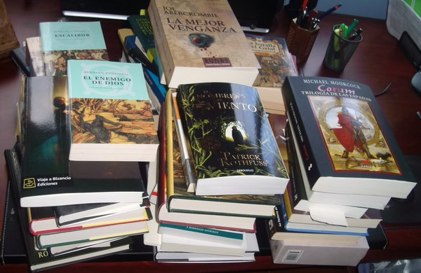

De los siete pecados capitales proclamados por la moral cristiana (pesada cadena donde las haya) incurro en mayor o menor medida en todos, si bien sobresalgo en cuatro: Gula, Ira, Soberbia y, ay, Pereza. Es precisamente por pereza que no he reseñado mis últimas lecturas y visionados, porque la verdad, escribir reseñas siempre me ha dado mucha pereza. Aún así he escrito bastantes, tanto en fanzines como en webs y de un tiempo a esta parte, en este blog. Y siempre me ha remordido la conciencia por no escribir más y mejores reseñas.

Quizá sea que me lo tomo demasiado en serio. Quizá. Siempre he creído que el reseñador tiene una responsabilidad nada baladí con el público que lee su reseña: una reseña puede inclinar la balanza en el juicio público que se tenga sobre una obra.

Incluso he procurado seguir unas reglas sencillas a la hora de escribirlas. Considero que una reseña debería contar siempre con una serie de elementos, a saber: **identificación** (donde se dan los datos esenciales para identificar de qué obra trata la reseña); **resumen** (una sinopsis del argumento, sus personajes, el marco y género de la historia) y, por último, la más delicada y controvertida, la **crítica**: donde el autor de la reseña pone la carne en el asador y dice si la obra le pareció o no meritoria, y por qué: y hagamos énfasis en este porqué. Si no podemos argumentar nuestras opiniones, de poco valen, porque les faltará el contexto adecuado para que el lector de la reseña pueda valorar si esta le es (o no) útil.

En una reseña no vale un simple: _esto es cojonudo_. No, eso no pasa de una recomendación más o menos afortunada. Y seamos francos: la mayoría de reseñas que leo en la red no pasan de ser recomendaciones con preámbulos más o menos ingeniosos. (Probablemente las mías estén también en ese saco.)

Luego está la reseña como moneda: en este mercadillo de las vanidades que es el fandom patrio, la reseña hace de divisa, y con ella se acarician o apuñalan espaldas según convenga y apetezca.

Y ya puestos, seamos valientes y hablemos de algo relacionado, pero no excluyente del fandom: las reseñas por encargo. Que haberlas las hay. Cifras y nombres no me pidan, eso lo ignoro, y mejor estoy así. Pero si hay algo que me gusta hacer es extrapolar a partir de mis propias experiencias. Como Terencio, opino que soy humano y nada humano me es ajeno.

Me explico: en los seis meses de vida de esta bitácora ya me han ofrecido libros para reseñar. El caso es que a primeros de año acepté dos de esos ofrecimientos (los de una agencia que trabaja para una editorial importante, todo hay que decirlo). No diré títulos; baste decir que es una trilogía cuyo primera parte se ha publicado a finales del año pasado y va sobre asesinos con capucha.

El caso es que acepté, y tras leerlos, me vi en la tesitura de tener que escribir reseñas tibias o incluso negativas de unos libros que me habían enviado por toda la cara. Y lo admito: me flaqueó el ánimo. La idea de endulzar las reseñas para seguir recibiendo libros por la patilla se formuló por sí sola, pero la conjuré apelando, precisamente, a otro de los pecados capitales en los que doy sopas con honda, la Soberbia. Uno tiene su conciencia, y no se compra con unos pocos libros gratis.

Ni que decir tiene que la editorial no me envió el tercer libro de la serie. (Irónicamente, y para más inri, las reseñas de este blog ocupan las primeras posiciones en Google para búsquedas con el título de esas obras. Eso debe de joder.)

Así que, extrapolando mi caso al resto, me pregunto cuántos reseñadores “profesionales” endulzan sus reseñas para que las editoriales les sigan enviando libros, en un pacto tácito cuya mención es tan insultante como obvia. Para un lector o bibliófilo empedernido\* lo cierto es que es un chollo… aunque acaba siendo una servidumbre, a mi modo de ver.

(\* Aunque suelen ser vicios simultáneos, no siempre se dan en la misma proporción; echen un ojo a la foto bajo este párrafo, como ejemplo: es mi pila de libros pendientes.)

Me lo pregunto, pero claro, quizá es que soy un malpensado con mucho tiempo libre y exceso de bilis. O un inoportuno, hablando de cosas que todo el mundo sabe o barrunta pero nadie dice. Al final, en esto de las reseñas, como en la vida, habrá de todo: y allá cada uno con su conciencia.

En cualquier caso, y para finalizar, valga lo que sigue como declaración de intenciones: a partir de ahora no pienso publicar más reseñas (si alguien se planteaba enviarme un libro para que se lo reseñe, por favor, que se abstenga). Descaradamente me subo al carro de las recomendaciones, pero al menos no las disfrazaré con alardes de ingenio: la franqueza tiene sus ventajas, aunque no sea muy política. De momento me ahorraré la onerosa tarea de reseñar las obras que no me hayan gustado. El silencio es muy elocuente; bien lo expresó Calderón de la Barca en _La vida es sueño_:

_Cuando tan torpe la razón se halla,_ _mejor habla, señor, quien mejor calla._
